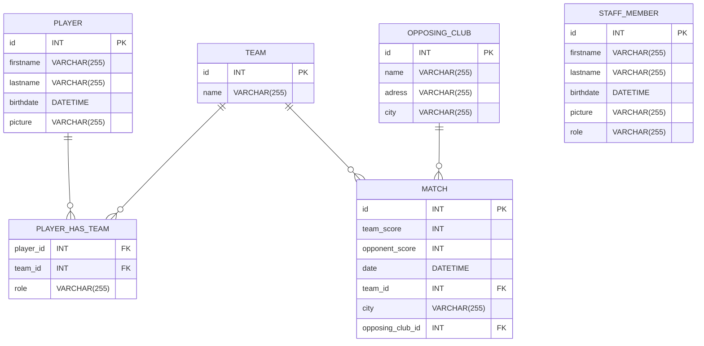

# EsportClub-Project
Site de gestion d'un club d'E-sport, de ses joueurs, équipes et matchs.

```mermaid
erDiagram
	PLAYER {
		id INT PK
		firstname VARCHAR(255)
		lastname VARCHAR(255)
		birthdate DATETIME
		picture VARCHAR(255)
	}
	PLAYER_HAS_TEAM {
		player_id INT FK
		team_id INT FK
		role VARCHAR(255)
	}
	TEAM {
		id INT PK
		name VARCHAR(255)
	}
	MATCH {
		id INT PK
		team_score INT
		opponent_score INT
		date DATETIME
		team_id INT FK
		city VARCHAR(255)
		opposing_club_id INT FK
	}
	OPPOSING_CLUB {
		id INT PK
		name VARCHAR(255)
		adress VARCHAR(255)
		city VARCHAR(255)
	}
	STAFF_MEMBER {
		id INT PK
		firstname VARCHAR(255)
		lastname VARCHAR(255)
		birthdate DATETIME
		picture VARCHAR(255)
		role VARCHAR(255)
	}
	
	TEAM ||--o{ PLAYER_HAS_TEAM : ""
	PLAYER ||--o{ PLAYER_HAS_TEAM : ""
	TEAM ||--o{ MATCH : ""
	OPPOSING_CLUB ||--o{ MATCH : ""
```
